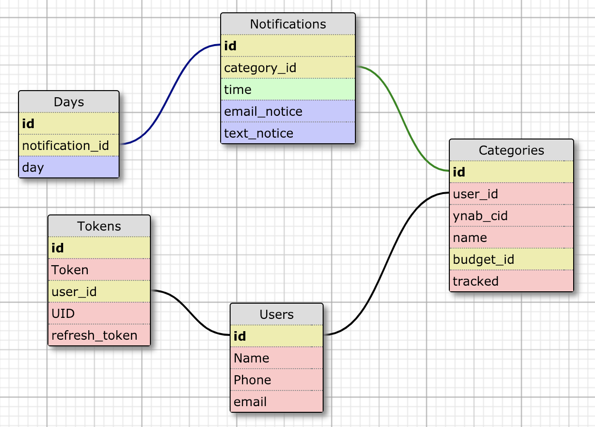

# README
## Budg-It

Budg-It is a rails-app designed to allow a user to access visual at-a-glance budget snapshots for particular categories of their own budget. Budg-It consumes data from the You Need a Budget API and also authenticates users using YNAB OmniAuth. It was developed using Ruby 2.4.1 and Rails 5.2.2.

### Setup:

To begin, clone this repo:

```
git@github.com:TimothyFell/Budg-It.git
```
After you `cd` into the project directory, run `bundle install` from the command line.
Next, run `bundle exec rake db:{drop,create,migrate}` to create the database and schema.

At this point, you should be able to run the local test suite using `bundle exec rspec`.

### Gems:

- rails
- pg
- puma
- sass-rails
- uglifier
- coffee-rails
- jbuilder
- bootsnap
- faraday
- figaro
- factory_bot_rails
- faker
- sendgrid-ruby
- omniauth
- omniauth-ynab
- twilio-ruby
- textris
- byebug
- rspec-rails
- database_cleaner
- simplecov
- shoulda-matchers
- capybara
- capybara-email
- launchy
- webmock
- vcr
- pry
- fuubar
- mailcatcher
- web-console
- listen
- tzinfo-data

### Schema:



### Contributing:

In order to contribute, please fork this repo, then clone your new repo and create a branch for your feature.

Please make sure to test your feature fully, using RSpec, before commiting your changes and pushing to your own repo, then create and submit a pull request back to this repository.

Please contact Dan Hutchinson at DanHutch5280@gmail.com or via GitHub, if you have any questions, etc.

* Services (job queues, cache servers, search engines, etc.)
* Deployment instructions


